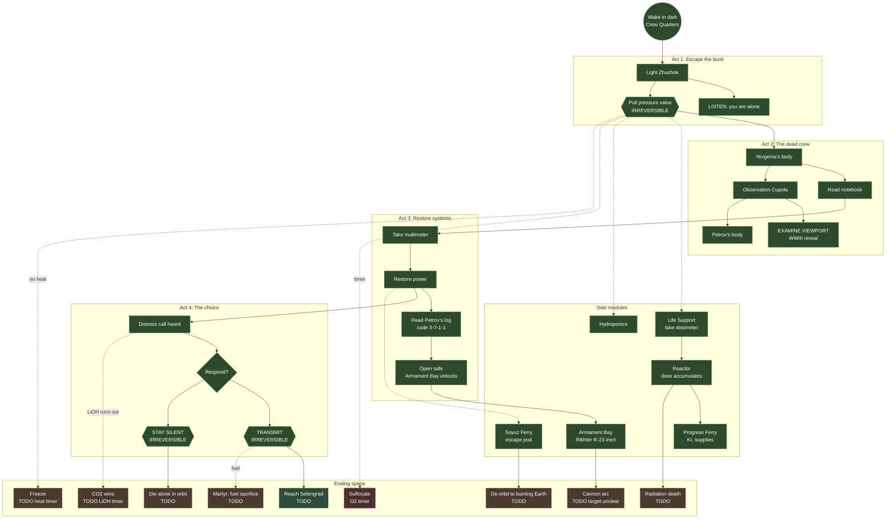

# MIR'S END — Story Structure

Single source of truth for the shape of the story. This document is the
flowchart we use to collaborate on the design. When the branching
changes, update the Mermaid graph and the ending roster. Everything
else in here (state tables, morale events, artifacts) is reference.

## Design principles

The game plays like a tabletop RPG session, not a Choose Your Own
Adventure.

- **Beats fire on state, not menu picks.** The player acts on the world.
  When the world's state crosses a threshold (notebook read, power
  restored, viewport examined), a beat fires.
- **Gates are soft.** Most blocks are narrative. You need the dosimeter.
  You need the code. A few are hard irreversibles (pressure valve,
  transmit, stay silent, de-orbit).
- **Pressure is the default condition.** O2 falls every turn. Morale
  erodes with discovery. Cumulative radiation dose is a clock you can
  watch. The question is never whether the player chose A or B. The
  question is whether they chose anything at all before the clocks ran
  out.
- **Endings are plural.** Some are failures of passivity (suffocate,
  CO2, freeze). Some are active choices with consequence (de-orbit,
  stay silent). Some are sacrifice (martyr). One or two are survival.

## Flowchart

Solid nodes are implemented. Dashed nodes are TODO. Double-bordered
nodes are irreversible choices.



## Endings roster

| # | Ending | Path | Status |
|---|---|---|---|
| 1 | Suffocate in orbit | Do nothing. O2 runs out. | implemented |
| 2 | CO2 wins | LiOH saturates before power is restored. | TODO |
| 3 | Freeze | Heat fails, no intervention. | TODO |
| 4 | Radiation death | Too much time in the Reactor. | TODO |
| 5 | Die alone in orbit | Stay silent, outlive life support. | TODO |
| 6 | De-orbit to burning Earth | Take Soyuz home. Grim. | TODO |
| 7 | Reach Selengrad | Transmit, combine fuel with Freedom, complete Moon burn. | TODO |
| 8 | Martyr | Transmit, give your fuel, Americans make it without you. | TODO |
| 9 | Cannon arc | Power the fire-control console. Target unclear. | TODO design |

## Act matrix

The game delivers a five-act dramatic arc in the overwhelming majority
of completed playthroughs. Act 1 is unified. Acts 2 through 5 expand in
available variety. The shape is an expanding diamond.

1 exposition → 2 rising-action paths → 3 climaxes → 4 falling-action
paths → 5 denouements.

Valid complete arcs = 2 (B) × 4 (D, derived from C) = 8 satisfying
five-act stories, plus one passive-failure ending when the player never
commits to an Act 3 climax.

| Scene | Label | Archetypal content | Implementation |
|-------|-------|--------------------|----------------|
| **A** | Exposition + inciting incident | Wake in dark Crew Quarters. Light Zhuchok. LISTEN: you are alone. Pull pressure valve (irreversible; you share half your air with a vacuum). Enter Main Corridor. Confront Yevgenia's body. The world you knew is over. | implemented |
| **B1** | Engineer's path | Notebook first. Multimeter. Restore power. Read Petrov's log. Open safe. Armament bay unlocks. You move through the station as a problem to be solved. | implemented |
| **B2** | Witness's path | Viewport first (WWIII reveal). Yevgenia. Petrov. Life Support. Hydroponics. The dosimeter's tick. You move through the station as a liturgy of what was lost. | partial (beats exist; emphasis not yet scripted) |
| **C1** | Climax: Respond | Hear the American distress call. TRANSMIT to Freedom Station. Commit to the Selengrad plan with Commander Chen. | partial (ends at "Begin preparations") |
| **C2** | Climax: Descend | Board the Soyuz. Commit to the de-orbit sequence. Point the ship at a burning Earth. | TODO |
| **C3** | Climax: Retaliate | Power the fire-control console. Aim the Rikhter R-23. Fire. | TODO |
| **D1** | Falling action: Coordinate | From C1. Fuel transfer mathematics. Burn window math. Both stations prepare. Tension is technical. | TODO |
| **D2** | Falling action: Sacrifice | From C1. Give your reserves to Freedom. You stay. Each system you visit is one you are dying in. | TODO |
| **D3** | Falling action: Reentry | From C2. Descent. Layers of soot. The continents through the porthole. Radio silence. | TODO |
| **D4** | Falling action: Aftermath | From C3. What the shot did. The space around Mir-3 different than before. | TODO |
| **E1** | Denouement: Selengrad | You and the Americans reach the Moon base. Something human survives. | TODO |
| **E2** | Denouement: Martyr | Americans reach Selengrad. You die in an empty station as their burn fires. | TODO |
| **E3** | Denouement: Return | Touchdown somewhere on the former continent. Ambiguity. Neither triumph nor catastrophe. | TODO |
| **E4** | Denouement: Myth | Whatever the cannon did. A footnote or a legend. You are not the one who will say which. | TODO |
| **E5** | Denouement: Tombstone | Passive failure. No climax was reached. The timers won. You die alone in orbit. This ending is shorter than the others and lacks catharsis, by design. | partial (suffocation ending exists; needs framing as Act 5 failure) |

### Transition map

```
A  →  B1 | B2
         ↓
        C1  →  D1 → E1
            ↘  D2 → E2
         C2  →  D3 → E3
         C3  →  D4 → E4
        (no climax, timers expire) → E5
```

### Act-transition gates

What the player must have accomplished to advance.

| Gate | Requires | Guards |
|------|----------|--------|
| A → B | Pulled the pressure valve; entered the corridor; examined at least one body | Act 1 cannot be skipped or shortcut. |
| B → C | Read notebook AND read log AND opened safe (Engineer emphasis) OR seen viewport AND examined both bodies AND gathered the dosimeter (Witness emphasis). Either satisfies. | Player cannot reach a climax without knowing the situation. |
| C → D | Any irreversible climax committed (transmit, de-orbit, fire cannon) | Locks out the other climaxes. |
| D → E | The falling action's scripted resolution fires | Endings are deterministic from Act 4. |

### LLM layers on top of the matrix

Two distinct layers, separately scoped.

1. **Perception matrix (cold, pre-generated).** Tagged descriptions have
   pre-generated variants keyed by player state buckets (morale, O2,
   radiation dose). Selected at runtime by ui.js. Changes *how* the
   player reads a scene. No latency. Deterministic. See issue #41.

2. **Active AI (warm, runtime).** An LLM observes player state and
   recent action history. Candidate roles:
    - **Director.** Infers whether the player is in B1 or B2 emphasis.
      Influences the framing of the Act 3 choice so the climax that
      lands matches the act-2 mode they built.
    - **Narrator.** Generates ephemeral transitional prose between
      scripted beats (station settling, thermal clicks, the occasional
      beat of Earth-light through a viewport).
    - **Embodied voice.** Gives Yevgenia's notebook and Petrov's log
      responsive additional content when re-read at different states.

The cold layer is the committed next step (issue #41). The warm layer is
designed after the cold layer ships.


Ten modules, each with six faces. Direction synonyms accepted
(fore/aft/port/starboard/zenith/nadir alongside N/S/E/W/U/D). See
[station-map.md](station-map.md) for the full per-face inventory.

```
                 [Life Support]
                      | UP
  [Hydroponics] <-- NODE --> [Armament Bay]
                      | DOWN
                 [Observation Cupola]

  [Crew Quarters] <----- NODE -----> [Command Module]
         | AFT                             | STBD
  [Reactor]                             [Soyuz]
         | STBD
  [Progress]
```

## State variables (Inform 7 truth states)

| Variable                     | Set by                                       | Gates                                    |
|------------------------------|----------------------------------------------|------------------------------------------|
| `chemical flashlight is lit` | Switch on flashlight                         | Movement out of Crew Quarters (darkness) |
| `corridor-pressurized`       | OPEN/PULL pressure valve                     | Movement north (vacuum)                  |
| `listening-to-station`       | First LISTEN in Crew Quarters                | Solo realization beat, morale −3         |
| `war-is-discovered`          | First EXAMINE VIEWPORT in Cupola             | Cupola nadir face text changes           |
| `power-is-restored`          | RESTORE POWER (needs multimeter + notebook)  | Console, comms, log readability          |
| `distress-call-heard`        | LISTEN in Command Module w/ power restored   | TRANSMIT gate                            |
| `responded-to-americans`     | TRANSMIT                                     | Selengrad story branch (TODO)            |
| `chose-silence`              | STAY SILENT                                  | Alternative branch (TODO)                |
| `petrov-log-read`            | READ LOG (needs power)                       | Arming code visible to safe              |
| `armament-bay-unlocked`      | OPEN SAFE (needs log read)                   | Main Corridor east hatch                 |

## Resources

| Resource | Start | Change per turn | Kill at                        |
|----------|-------|-----------------|--------------------------------|
| Oxygen   | 100   | −1              | 0 → end: "You have suffocated" |
| Morale   | 50    | event-driven    | no hard floor (display-only)   |
| Score    | 0     | event-driven    | max 14                         |

## Morale events

| Event                                 | Δ    |
|---------------------------------------|------|
| Switch on flashlight (first)          | +5   |
| Listen in Crew Quarters (first)       | −3   |
| Examine viewport (first)              | −15  |
| Restore power                         | +10  |
| Listen → distress call (first)        | +3   |
| Transmit                              | +8   |
| Stay silent                           | −8   |
| In Reactor Module                     | −1 per turn |

## Irreversibles

The handful of actions that cannot be taken back. These are the real
choice points.

- **Pull pressure valve.** You share half your air with a vacuum. The
  hatch opens. No going back to a sealed bunk.
- **Transmit.** You key the mic. Chen answers. The Selengrad
  preparation begins.
- **Stay silent.** The loop fades. Chen is gone. The combined fuel math
  is no longer available to you.
- **De-orbit (TODO).** You ride Soyuz down. There is no returning to
  the station.

## Artifacts replacing dialogue

The crew is dead in the prologue. Information they used to deliver
through dialogue now lives in two artifacts.

- **Yevgenia's notebook** (clipped to her body, takeable, readable):
  EMP confirmation, power-restore sequence, life support timeline,
  Selengrad math, caretaker status of the Moon base.
- **Petrov's last log** (on the command console, requires power):
  EMP timestamp, "second object inbound" note, classified armament
  bay disclosure, arming code 3-7-1-1, final orders to whoever reads
  it.

## What's NOT in the prototype

Matches the TODO nodes in the flowchart.

- The Moon flight. The game ends at "Begin preparations."
- The cannon firing mechanic. The safe opens. The weapon is inert.
- Radiation damage. The dosimeter ticks but accumulated dose does not
  yet kill you.
- Heat failure. CO2 saturation. Both are mentioned in flavor text
  but not wired as timers.
- The de-orbit ending via Soyuz.
- The martyr ending.
- The LLM perception layer (see issue #41).

## Updating this doc

When the story shape changes, edit the Mermaid graph and the endings
roster first. The state and morale tables are reference. If you add a
new truth state to `story.ni`, add a row. If you add a new morale
event, add a row. CI does not enforce this. It is on us to keep it
honest.
